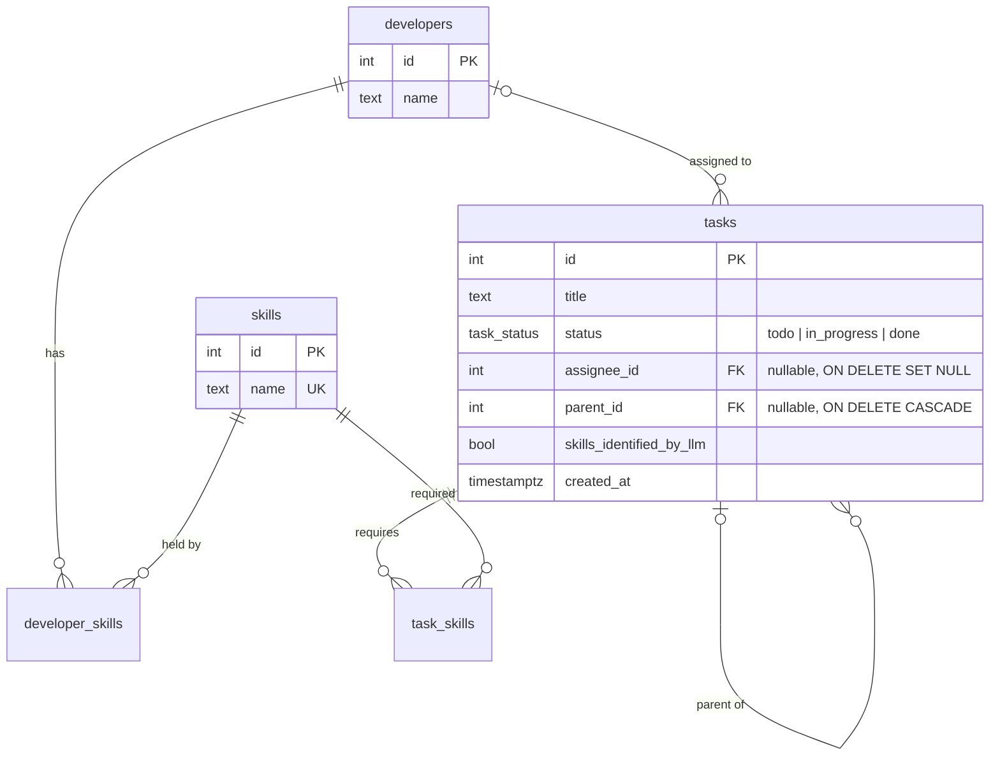

# Taskboard: Task Assignment App

A full-stack app for creating tasks (with nested subtasks), identifying the skills they need with an LLM, and assigning them to developers who have those skills.

| Layer    | Stack                                                                 |
| -------- | --------------------------------------------------------------------- |
| Frontend | React 19, Vite, TypeScript, Tailwind CSS v4, shadcn/ui (Radix), Lucide, TanStack Query, React Router |
| Backend  | Node.js 22, Express 5, TypeScript, Zod, Drizzle ORM                   |
| Database | PostgreSQL 18                                                         |
| LLM      | Google Gemini (`generateContent` with a JSON response schema)         |
| Tooling  | pnpm workspaces, Vitest + Supertest + PGlite, ESLint, Docker Compose  |

## Quick start (Docker)

```bash
cp .env.example .env          # optional: add GEMINI_API_KEY (free at https://aistudio.google.com/apikey)
docker compose up --build
```

Open **http://localhost:8080**.

On first boot the backend applies migrations and seeds Alice, Bob, Carol and Dave. The seed is idempotent, so restarts do not duplicate data. The app runs fully without a Gemini key; tasks created without skills are then saved with no skills (see [LLM skill identification](#llm-skill-identification)).

To reset all data: `docker compose down -v`.

## Local development

Requires Node 22+ and pnpm 10.

```bash
pnpm install
cp .env.example .env                  # DATABASE_URL points at the compose db on port 5433
docker compose up -d db
pnpm --filter backend db:migrate
pnpm --filter backend db:seed
pnpm dev                              # API on :3000, web on :5173 (proxies /api)
```

Checks:

```bash
pnpm test        # backend tests (in-memory Postgres, no Docker needed)
pnpm typecheck
pnpm lint
```

## Project structure

```
backend/
  drizzle/                 SQL migrations (0000 init, 0001 subtasks, 0002 LLM skills)
  src/
    db/                    schema, client, migrate and seed scripts
    routes/                HTTP layer: validation (Zod) and status codes only
    services/              queries and business rules
      tasks.ts             tree reads, nested create, assignment and Done rules
      skill-identifier.ts  Gemini integration
    app.ts                 createApp(deps): dependency injection for tests
  test/                    API and unit tests
frontend/
  src/
    pages/                 task list, create task
    components/            task-draft-editor (recursive), status/assignee selects, ...
    hooks/queries.ts       TanStack Query hooks, optimistic updates
    lib/                   API client, shared helpers
docker-compose.yml         db, backend, frontend (nginx)
```

## Data model



- **Many-to-many skills** through `developer_skills` and `task_skills`, with composite primary keys so a pair can't be duplicated.
- **Subtasks are tasks** with a `parent_id` (an adjacency list). A subtask therefore has exactly the same properties as a task, and there is no separate table to keep in sync. A `CHECK (parent_id <> id)` blocks self-parenting; `parent_id` and `assignee_id` are indexed.
- **Status is a Postgres enum**, so invalid values are rejected by the database as well as by the API.
- **Identity columns** (`GENERATED ALWAYS AS IDENTITY`) instead of `serial`.

The migrations mirror the brief. `0000` is Part 1, `0001` adds `parent_id` for Part 4, and `0002` adds `skills_identified_by_llm` for Part 5, so the history shows how the schema evolved.

## API

All responses are JSON. Errors have the shape `{ "error": { "code": "...", "message": "..." } }`.

| Method | Path                  | Description |
| ------ | --------------------- | ----------- |
| GET    | `/api/tasks`          | Top-level tasks, each with its full `subtasks` tree |
| GET    | `/api/tasks/:id`      | One task with its full subtask tree |
| POST   | `/api/tasks`          | Create a task and, optionally, nested subtasks |
| PATCH  | `/api/tasks/:id`      | Change `status` and/or `assigneeId` (`null` unassigns) |
| GET    | `/api/developers`     | Developers with their skills and assigned tasks |
| GET    | `/api/developers/:id` | One developer |
| GET    | `/api/skills`         | Skills with the developers who have them |
| GET    | `/api/skills/:id`     | One skill |

Create body (recursive, at most 50 tasks per request):

```json
{
  "title": "Profile page",
  "skillIds": [1, 2],
  "subtasks": [
    { "title": "Profile form", "skillIds": [1] },
    { "title": "Profile API", "subtasks": [{ "title": "Avatar upload" }] }
  ]
}
```

A task object:

```json
{
  "id": 5, "title": "Profile API", "status": "todo", "parentId": 4,
  "skills": [{ "id": 2, "name": "Backend" }], "skillsIdentifiedByLlm": true,
  "assignee": null, "createdAt": "2026-09-22T04:43:21.902Z", "subtasks": []
}
```

| Status | Code                | When |
| ------ | ------------------- | ---- |
| 400    | `VALIDATION_ERROR`  | Body or id fails validation (includes `issues`) |
| 404    | `NOT_FOUND`         | Unknown task, developer or skill |
| 409    | `SUBTASKS_NOT_DONE` | Setting Done while a subtask is not Done |
| 409    | `PARENT_DONE`       | Reopening a subtask whose parent is Done |
| 422    | `SKILL_MISMATCH`    | Assignee lacks one of the task's required skills |
| 422    | `UNKNOWN_SKILL` / `UNKNOWN_DEVELOPER` | Referenced id does not exist |

## Business rules

**Assignment.** A developer can be assigned only if they hold *every* skill the task requires (Carol can take a Frontend + Backend task; Bob cannot). A task with no required skills can go to anyone. The API enforces this; the UI mirrors it by disabling ineligible developers and showing what they're missing.

**Completion.** A task can move to Done only when all its direct subtasks are Done. Because the rule applies at every level, checking direct children is enough to cover the whole subtree.

That argument relies on an invariant: *a Done task only has Done subtasks.* The brief's rule alone can't guarantee it, because a subtask could be moved back to To-do after its parent was completed. So the API also rejects reopening a subtask while its parent is Done (`PARENT_DONE`). The user reopens the parent first. I chose to reject rather than silently reopening the parent, because a status change you didn't make is surprising.

**Concurrency.** Both checks run in a transaction under `SELECT ... FOR UPDATE`, always locking the parent row before the child. A concurrent "complete parent" and "reopen child" therefore serialize instead of both succeeding and breaking the invariant, and the consistent lock order prevents deadlocks.

## LLM skill identification

When a task or subtask is created without skills, the backend asks Gemini to classify its title.

- **One batched call per request.** Every skill-less node in the submitted tree is sent together as `[{index, title}]`, so a task with five subtasks costs one round trip, not six.
- **Constrained output.** The request uses `responseMimeType: application/json` with a `responseSchema` whose skill field is an `enum` of the skills currently in the database. The model can only answer with real skill names; the response is validated with Zod anyway, and unknown names are dropped.
- **Prompt.** The system instruction defines each skill, gives the three examples from the brief as few-shot examples, and states that titles are data to classify, not instructions. Combined with the enum, a malicious title can at worst cause a wrong classification.
- **Outside the transaction.** The call happens before the insert transaction opens, so network latency never holds database locks.
- **Graceful failure.** With no key, a timeout (15s), an HTTP error or malformed output, the task is still created, with no skills, and a warning is logged. Failing the whole create because an optional enrichment failed would be worse for the user.
- **Provenance.** `skills_identified_by_llm` records where skills came from; the UI shows a sparkle with a tooltip.

The default model is `gemini-3.5-flash-lite` (fast and cheap for classification); override it with `GEMINI_MODEL`.

## Frontend notes

- **Task list:** a collapsible tree with indentation and subtask progress per parent. Status and assignee changes are optimistic (instant UI, rolled back with a toast if the server rejects them).
- **Status picker:** mirrors the completion rules, disabling Done while subtasks are open and disabling reopening while the parent is Done, each with the reason shown.
- **Create page:** `TaskDraftEditor` renders itself recursively for each subtask, so nesting depth is unlimited on the client (the server caps a request at 50 tasks). Subtasks are numbered in outline form (1, 2, 2.1).
- **API access:** in dev, Vite proxies `/api`; in Docker, nginx does. The browser always calls the same origin, so no CORS configuration is needed.

## Testing

`pnpm test` runs 26 backend tests with Vitest and Supertest against **PGlite**, a WASM build of real Postgres that runs in-process. Each test file gets a fresh database with the real migrations and seed applied, so the tests cover the actual SQL (constraints, enums, row locks, cascades) without needing Docker. The LLM is injected into `createApp`, so tests use a stub and never hit the network. The Gemini client has its own unit tests with a fake `fetch`, covering the request shape and every failure path.

Covered: seeded data, reads and 404s, validation, skill-matched assignment, nested create (including rollback of the whole tree on one bad node), the Done and reopen rules at multiple depths, LLM batching and fallback, and assignment rules applied to LLM-identified skills.

## Possible next steps

- Delete tasks, and edit titles or skills after creation.
- Frontend component tests (Vitest + Testing Library) and a Playwright end-to-end smoke test.
- Code-split the frontend bundle (about 520 kB before gzip, mostly Radix and React).
- Retry the LLM call with backoff, or classify asynchronously and let the UI show a pending state.
