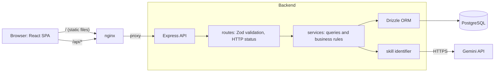
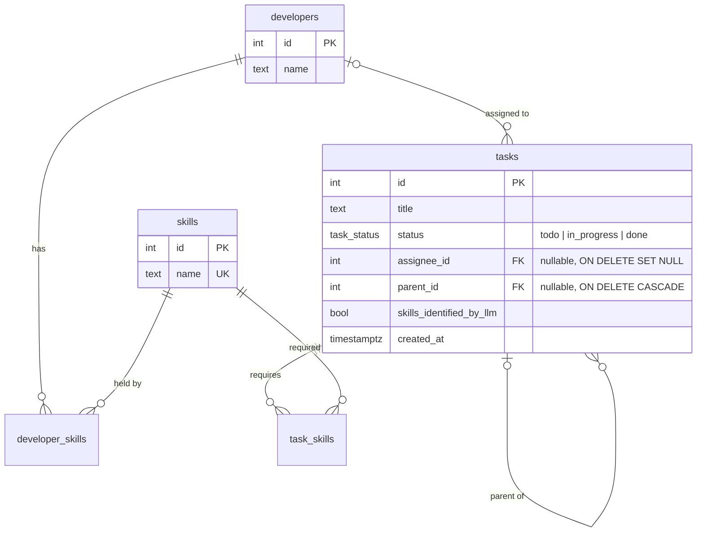

# Taskboard: Task Assignment App

A full-stack app for creating tasks (with nested subtasks), identifying the skills they need with an LLM, and assigning them to developers who have those skills.

| Layer    | Stack                                                                 |
| -------- | --------------------------------------------------------------------- |
| Frontend | React 19, Vite, TypeScript, Tailwind CSS v4, shadcn/ui (Radix), Lucide, TanStack Query, React Router |
| Backend  | Node.js 22, Express 5, TypeScript, Zod, Drizzle ORM                   |
| Database | PostgreSQL 18                                                         |
| LLM      | Google Gemini (`generateContent` with a JSON response schema)         |
| Testing  | Vitest, Supertest + PGlite (API), Testing Library + jsdom (components), Playwright (end-to-end) |
| Tooling  | pnpm workspaces, ESLint, Docker Compose                               |

## Quick start (Docker)

```bash
cp .env.example .env          # optional: add GEMINI_API_KEY (free at https://aistudio.google.com/apikey)
docker compose up --build
```

Open **http://localhost:8080**.

On first boot the backend applies migrations and seeds Alice, Bob, Carol and Dave plus the three example tasks from the wireframe. The seed is idempotent (sample tasks are matched by title), so restarts do not duplicate data. The app runs fully without a Gemini key; tasks created without skills are then saved with no skills (see [LLM skill identification](#llm-skill-identification)).

To reset all data: `docker compose down -v`.

## Local development

Requires Node 22+ and pnpm 10.

```bash
pnpm install
cp .env.example .env                  # DATABASE_URL points at the compose db on port 5433
docker compose up -d db
pnpm --filter backend db:migrate
pnpm --filter backend db:seed
pnpm dev                              # API on :3000, web on :5173 (proxies /api)
```

Checks:

```bash
pnpm test        # backend + frontend tests; no database or running app needed
pnpm typecheck
pnpm lint
```

End-to-end smoke test (needs the app running; defaults to the Docker stack on :8080):

```bash
pnpm --filter e2e exec playwright install chromium   # first time only
pnpm e2e                                             # BASE_URL=http://localhost:5173 pnpm e2e for pnpm dev
```

## Project structure

```
backend/
  drizzle/                 SQL migrations (0000 init, 0001 subtasks, 0002 LLM skills)
  src/
    db/                    schema, client, migrate and seed scripts
    routes/                HTTP layer: validation (Zod) and status codes only
    services/              queries and business rules
      tasks.ts             tree reads, nested create, assignment and Done rules
      skill-identifier.ts  Gemini integration
    app.ts                 createApp(deps): dependency injection for tests
  test/                    API and unit tests
frontend/
  src/
    pages/                 task list, create task
    components/            task-draft-editor (recursive), status/assignee selects,
                           edit/delete dialogs, ... (tests sit next to components)
    hooks/queries.ts       TanStack Query hooks, optimistic updates
    lib/                   API client, shared helpers
    test/                  test setup and render helpers
e2e/
  tests/smoke.spec.ts      Playwright journey through the running app
docker-compose.yml         db, backend, frontend (nginx)
```

## Architecture



- **Three containers:** `db` (Postgres), `backend` (Express), `frontend` (nginx serving the built SPA). Compose starts them in order, gated on health checks. The backend applies migrations and the idempotent seed before it starts listening.
- **One origin.** nginx serves the SPA and proxies `/api` to the backend (Vite's dev server does the same in development), so the browser never makes cross-origin calls and no CORS setup is needed.
- **Layered backend.** Routes only parse input with Zod and map results to HTTP; services hold every query and business rule; `createApp(deps)` receives the database and the skill identifier as parameters, so tests swap in an in-memory Postgres and a stub LLM without mocking modules.
- **Rules live in the API; the UI mirrors them.** The server is the source of truth for assignment and completion rules. The UI repeats them only to disable impossible choices up front and explain why.

A create request, end to end: the form builds a nested payload, Zod validates it (at most 50 tasks), the service checks that referenced skills exist, sends every skill-less title to Gemini in one batched call, then inserts the whole tree in a single transaction and returns it.

## Data model



- **Many-to-many skills** through `developer_skills` and `task_skills`, with composite primary keys so a pair can't be duplicated.
- **Subtasks are tasks** with a `parent_id` (an adjacency list). A subtask therefore has exactly the same properties as a task, and there is no separate table to keep in sync. A `CHECK (parent_id <> id)` blocks self-parenting; `parent_id` and `assignee_id` are indexed.
- **Status is a Postgres enum**, so invalid values are rejected by the database as well as by the API.
- **Identity columns** (`GENERATED ALWAYS AS IDENTITY`) instead of `serial`.

The migrations mirror the brief. `0000` is Part 1, `0001` adds `parent_id` for Part 4, and `0002` adds `skills_identified_by_llm` for Part 5, so the history shows how the schema evolved.

## API

All responses are JSON. Errors have the shape `{ "error": { "code": "...", "message": "..." } }`.

| Method | Path                  | Description |
| ------ | --------------------- | ----------- |
| GET    | `/api/tasks`          | Top-level tasks, each with its full `subtasks` tree |
| GET    | `/api/tasks/:id`      | One task with its full subtask tree |
| POST   | `/api/tasks`          | Create a task and, optionally, nested subtasks |
| PATCH  | `/api/tasks/:id`      | Change any of `title`, `skillIds`, `status`, `assigneeId` (`null` unassigns) |
| DELETE | `/api/tasks/:id`      | Delete a task and its whole subtree (204) |
| GET    | `/api/developers`     | Developers with their skills and assigned tasks |
| GET    | `/api/developers/:id` | One developer |
| GET    | `/api/skills`         | Skills with the developers who have them |
| GET    | `/api/skills/:id`     | One skill |

Create body (recursive, at most 50 tasks per request):

```json
{
  "title": "Profile page",
  "skillIds": [1, 2],
  "subtasks": [
    { "title": "Profile form", "skillIds": [1] },
    { "title": "Profile API", "subtasks": [{ "title": "Avatar upload" }] }
  ]
}
```

A task object:

```json
{
  "id": 5, "title": "Profile API", "status": "todo", "parentId": 4,
  "skills": [{ "id": 2, "name": "Backend" }], "skillsIdentifiedByLlm": true,
  "assignee": null, "createdAt": "2026-09-22T04:43:21.902Z", "subtasks": []
}
```

| Status | Code                | When |
| ------ | ------------------- | ---- |
| 400    | `VALIDATION_ERROR`  | Body or id fails validation (includes `issues`) |
| 404    | `NOT_FOUND`         | Unknown task, developer or skill |
| 409    | `SUBTASKS_NOT_DONE` | Setting Done while a subtask is not Done |
| 409    | `PARENT_DONE`       | Reopening a subtask whose parent is Done |
| 422    | `SKILL_MISMATCH`    | Assignee lacks one of the task's required skills |
| 422    | `UNKNOWN_SKILL` / `UNKNOWN_DEVELOPER` | Referenced id does not exist |

## Business rules

**Assignment.** A developer can be assigned only if they hold *every* skill the task requires (Carol can take a Frontend + Backend task; Bob cannot). A task with no required skills can go to anyone. The API enforces this; the UI mirrors it by disabling ineligible developers and showing what they're missing.

**Editing.** Title and required skills can be changed after creation. The assignment rule is checked against the state *after* the edit, so adding a skill the current assignee lacks is rejected (`SKILL_MISMATCH`), while changing skills and assignee together in one request works. Sending `skillIds: []` asks the LLM to identify skills from the (possibly new) title, mirroring creation; choosing skills clears the AI marker, and editing only the title leaves skills untouched.

**Deleting** a task deletes its subtasks with it (`ON DELETE CASCADE` on `parent_id`). Removing subtasks can't break the completion invariant below, since it can only remove open children, never add them.

**Completion.** A task can move to Done only when all its direct subtasks are Done. Because the rule applies at every level, checking direct children is enough to cover the whole subtree.

That argument relies on an invariant: *a Done task only has Done subtasks.* The brief's rule alone can't guarantee it, because a subtask could be moved back to To-do after its parent was completed. So the API also rejects reopening a subtask while its parent is Done (`PARENT_DONE`). The user reopens the parent first. I chose to reject rather than silently reopening the parent, because a status change you didn't make is surprising.

**Concurrency.** Both checks run in a transaction under `SELECT ... FOR UPDATE`, always locking the parent row before the child. A concurrent "complete parent" and "reopen child" therefore serialize instead of both succeeding and breaking the invariant, and the consistent lock order prevents deadlocks.

## LLM skill identification

When a task or subtask is created without skills, the backend asks Gemini to classify its title.

- **One batched call per request.** Every skill-less node in the submitted tree is sent together as `[{index, title}]`, so a task with five subtasks costs one round trip, not six.
- **Constrained output.** The request uses `responseMimeType: application/json` with a `responseSchema` whose skill field is an `enum` of the skills currently in the database. The model can only answer with real skill names; the response is validated with Zod anyway, and unknown names are dropped.
- **Prompt.** The system instruction defines each skill, gives the three examples from the brief as few-shot examples, and states that titles are data to classify, not instructions. Combined with the enum, a malicious title can at worst cause a wrong classification.
- **Outside the transaction.** The call happens before the insert transaction opens, so network latency never holds database locks.
- **Graceful failure.** With no key, a timeout (15s), an HTTP error or malformed output, the task is still created, with no skills, and a warning is logged. Failing the whole create because an optional enrichment failed would be worse for the user.
- **Provenance.** `skills_identified_by_llm` records where skills came from; the UI shows a sparkle with a tooltip.

The default model is `gemini-3.5-flash-lite` (fast and cheap for classification); override it with `GEMINI_MODEL`. Checked against the live API with the brief's three examples: all three classified as expected, in one batched call of about 1.6s.

## Frontend notes

- **Task list:** a collapsible tree with indentation and subtask progress per parent. Status and assignee changes are optimistic (instant UI, rolled back with a toast if the server rejects them).
- **Status picker:** mirrors the completion rules, disabling Done while subtasks are open and disabling reopening while the parent is Done, each with the reason shown.
- **Row actions:** each task has a menu with Edit (a dialog reusing the create form's fields, sending only what changed so untouched AI skills keep their marker) and Delete (a confirmation that says how many subtasks go with it, and stays open until the server confirms).
- **Create page:** `TaskDraftEditor` renders itself recursively for each subtask, so nesting depth is unlimited on the client (the server caps a request at 50 tasks). Subtasks are numbered in outline form (1, 2, 2.1).
- **API access:** in dev, Vite proxies `/api`; in Docker, nginx does. The browser always calls the same origin, so no CORS configuration is needed.

## Libraries and why

Every version is pinned exactly (`save-exact`). Releases less than a week old were skipped in favour of the previous version, to limit supply-chain risk.

**Backend**

| Library | Why | Considered instead |
| ------- | --- | ------------------ |
| Express 5 | The brief suggests it; minimal and widely known. v5 forwards errors from `async` handlers to the error middleware, so no wrapper is needed. | Fastify, NestJS: more structure than a handful of endpoints needs. |
| Drizzle ORM + drizzle-kit | Schema written in TypeScript, so query results are typed without codegen. Generates readable SQL migrations, and supports row locks (`FOR UPDATE`), which the completion rule depends on. Runs on both node-postgres and PGlite, which is what makes the in-memory tests possible. | Prisma: heavier engine binary in Docker and awkward for self-referencing trees. Raw `pg`: every result would need hand-written types. |
| pg (node-postgres) | The standard Postgres driver, with connection pooling. | |
| Zod | Validates request bodies and the LLM's JSON response, and derives TypeScript types from the same schema. Handles the recursive subtask shape. | Hand-written checks. |
| (no Gemini SDK) | The call is one `fetch` to `generateContent`, so an SDK would add a dependency without removing code, and plain `fetch` is easy to fake in tests. | `@google/genai`. |

**Frontend**

| Library | Why | Considered instead |
| ------- | --- | ------------------ |
| React 19 + Vite | Required React; Vite gives instant dev reloads, an `/api` proxy, and a static build that nginx can serve. | Next.js: its server features are unused in a pure SPA backed by a separate API. |
| Tailwind CSS v4 | Requested. Styles live next to markup, and the design tokens come from CSS variables. | |
| shadcn/ui on Radix (`radix-ui`, `class-variance-authority`, `cn`, `tw-animate-css`) | Requested. Components are copied into `src/components/ui`, so they are owned and editable rather than a black-box dependency. Radix supplies the accessibility (keyboard navigation, focus trapping, ARIA) for the select, dialog and menu primitives. `cn` is shadcn's class merger; `tw-animate-css` provides the open/close animations. | |
| Lucide | Requested; the icon set shadcn uses. | |
| TanStack Query | Caching, refetching after mutations, and optimistic updates with rollback, which is how status and assignee changes apply instantly and undo themselves if the server rejects them. | `useEffect` + `useState`: re-implements all of that by hand. |
| React Router | Client-side routing for the two pages, with deep links working behind nginx's SPA fallback. | |
| Sonner | Toasts for success and for server rejections (for example `SKILL_MISMATCH`). | |
| Geist (`@fontsource-variable/geist`) | Self-hosted font from the shadcn preset; no request to a third-party font CDN. | |

Two packages are present only because the shadcn CLI added them: `shadcn` itself (its stylesheet is imported by `index.css`) and `next-themes` (imported by the generated toast component, but inert here since the app has no theme switcher).

**Testing and tooling**

| Library | Why |
| ------- | --- |
| TypeScript 6 | Strict typing end to end. Version 6 rather than 7, because `typescript-eslint` does not support 7 yet. |
| Vitest | One test runner for both packages; it reuses the Vite config and runs TypeScript directly. |
| Supertest | Sends real HTTP requests to the Express app in-process. |
| PGlite | Real Postgres compiled to WASM and run in-process, so backend tests exercise actual constraints, enums, locks and cascades with no Docker. |
| Testing Library + jsdom | Tests components the way a user reaches them (roles and labels), not through implementation details. |
| Playwright | Drives the real app in Chromium for the end-to-end smoke test. |
| tsx | Runs TypeScript directly in development (`watch` mode) and for the migrate and seed scripts. |
| ESLint + typescript-eslint | Catches bugs the type checker doesn't. |
| pnpm workspaces | One lockfile for backend, frontend and e2e; Docker builds install only the package they need with `--filter`. |

## Testing

Three layers, from fastest to most realistic:

| Command    | What                                   | Count | Needs |
| ---------- | -------------------------------------- | ----- | ----- |
| `pnpm test` | Backend API and unit tests            | 36    | nothing |
| `pnpm test` | Frontend component tests              | 14    | nothing |
| `pnpm e2e`  | Playwright smoke test of a full journey | 1   | running app |

**Backend** (Vitest + Supertest) runs against **PGlite**, a WASM build of real Postgres that runs in-process. Each test file gets a fresh database with the real migrations and seed applied, so the tests exercise the actual SQL (constraints, enums, row locks, cascades) without Docker. The LLM is injected into `createApp`, so tests use a stub and never hit the network; the Gemini client has its own unit tests with a fake `fetch` covering the request shape and every failure path. Covered: seeded data, reads and 404s, validation, skill-matched assignment, nested create (including rollback of the whole tree on one bad node), the Done and reopen rules at multiple depths, editing (including the resulting-state assignment check and LLM re-identification), cascading delete, and LLM batching and fallback.

**Frontend** (Vitest + Testing Library on jsdom) renders components with a query cache pre-filled with skills and developers. Covered: assignee eligibility, blocked statuses, the recursive draft editor (outline numbering, nesting, removal, the payload it builds), and the edit dialog sending only changed fields.

**End-to-end** (Playwright) drives the real app in Chromium: create a task with a subtask, check that only qualified developers can be assigned, confirm Done is blocked until the subtask is Done, then edit and delete. It picks skills explicitly so it never depends on Gemini, and uses unique titles so it can run against a database that already has data.

## Possible next steps

- Code-split the frontend bundle (about 570 kB before gzip, mostly Radix and React).
- Make `/api/health` check the database, so the container health check catches a lost connection.
- On the task list, keep showing cached tasks with a "couldn't refresh" notice when a refetch fails, instead of replacing them with an error.
- Retry the LLM call with backoff, or classify asynchronously and let the UI show a pending state.
